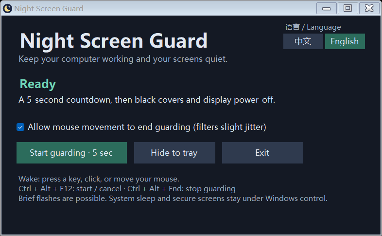

# Night Screen Guard · 夜间息屏守护

[中文](README.md) | [English](README.en.md)

[](https://github.com/PB-in-GH/NightScreenGuard/actions/workflows/build.yml)

**[Download for Windows](https://github.com/PB-in-GH/NightScreenGuard/releases/latest) · [Report an issue](https://github.com/PB-in-GH/NightScreenGuard/issues)**

Keep your computer working while keeping its displays off as much as possible. Useful for overnight downloads, computation and background tasks.

This small Windows utility starts only when you ask it to. It covers connected screens with black windows, requests display power-off, and requests power-off again after an unexpected display-on event. Keyboard or mouse input ends guarding.

> Zero flashes cannot be guaranteed. This is not a screen lock or a privacy barrier. Monitor backlights, drivers and Windows secure desktops may remain outside its control.



## Features

- Live **中文 / English** switching across the window, statuses, messages and tray menu.
- Remembers your language. On first launch, uses Chinese for a Chinese Windows UI, otherwise English.
- Manual start with a five-second countdown. No automatic takeover of the system sleep/moon key or Windows display timeout.
- Black covers, display-state notifications and periodic power-off requests.
- End guarding with a key, mouse click or sufficient movement. Movement-to-wake can be disabled.
- Moon-and-stars tray icon: single left click opens the window; right click opens the menu.
- Temporarily prevents automatic system sleep while guarding, without editing your power plan.
- Portable, no elevation, network access, telemetry or third-party dependency downloads required.

## Run

Target: **Windows 10/11 x64** with **.NET Framework 4.8** enabled. This release was checked on one Windows 11 x64 computer, not every system, display or input device. Other operating systems and native ARM64 builds are not supported yet.

If you have a portable build, extract it and launch `NightScreenGuard.exe`. A source download does not include the executable; build it using the steps below.

1. Keep your monitor powered on and select your desired Windows display configuration.
2. Choose **中文 / English** at the top right.
3. Click **Start guarding · 5 sec**, then release your keyboard and mouse.
4. Press a regular key, click or move the mouse to stop. Shift or gentle mouse movement is recommended: the wake input is not guaranteed to be consumed.

There is a roughly 0.7-second input grace period after guarding starts, plus slight mouse-jitter filtering. The window close button hides to the tray; use **Exit** to quit. Guarding neither starts automatically nor ends after a fixed time.

| Action | Result |
| --- | --- |
| Ctrl + Alt + F12 | Start the five-second countdown, or cancel guarding |
| Ctrl + Alt + End | Stop guarding and open the window |
| Esc during countdown | Cancel the countdown |
| Single left click on tray icon | Open the window |
| Right click on tray icon | Open the start, stop and exit menu |

Some keyboards send a sleep command rather than F12 from the moon key. Use the window button if the shortcut is unavailable. The original Windows moon-key binding is not changed. Manual sleep, lid-close actions, hibernation and shutdown are not blocked.

## Build from source

Open Windows PowerShell in the project directory:

```powershell
powershell -NoProfile -ExecutionPolicy Bypass -File .\build.ps1
```

The script uses the Windows .NET Framework C# compiler and downloads no dependencies. The executable and accompanying documentation are placed in `dist/`. `ExecutionPolicy Bypass` applies only to that PowerShell process; it does not permanently change the execution policy.

```powershell
# State logic, translations and preference persistence; no display power-off
powershell -NoProfile -ExecutionPolicy Bypass -File .\test.ps1

# Also check live language switching and window rendering; requires an interactive desktop
powershell -NoProfile -ExecutionPolicy Bypass -File .\test.ps1 -UI
```

Results are written to `test-results/`. The UI test briefly displays its own window and renders screenshots of that window. It does not capture the desktop, save a language preference or turn off your displays. These checks do not replace physical-monitor or overnight testing. See [validation notes](docs/VALIDATION.md).

## How it works and limitations

While guarding, the app subscribes to Windows display-state notifications. On an unexpected display-on event it allows about 150 ms for input detection before requesting power-off again, with a fallback request every 1.5 seconds. Black windows reduce desktop exposure; an execution-state request keeps background work running.

- A display must start waking before the app can respond. Brief flashes or backlight glow may occur. Windows reporting a display as on does not prove an external monitor is visibly on.
- This is not a lock screen. It does not lock your account, suppress every popup or replace Windows Do Not Disturb.
- Secure desktops, lock screens, remote sessions and virtual input devices can affect detection. A session-input-time fallback favors recovery over trapping the user behind a dark display.
- Automation or virtual input may end guarding. This is not a security mechanism for identifying a physical user.
- Guarding ends when the app exits or crashes, or Windows restarts. No startup entry, service or scheduled task is installed.

## Privacy and local files

No network access. No typed text, key values, mouse positions or desktop screenshots are recorded. Normal operation writes only these files alongside the executable:

- `language.txt`: `zh` or `en`. A read-only directory allows switching but prevents saving.
- `guard.log` and `guard.log.old`: startup, display states and stop reasons; rotated at about 256 KB. Logs can reveal usage times, so review them before sharing.

These files, test results, shortcuts and build outputs are excluded by `.gitignore`. To remove the application, exit from the tray and delete its extracted directory.

## Layout

```text
src/                 Application, version information and Windows manifest
assets/              Original moon-and-stars icon
scripts/             Icon generator source and rebuild script
docs/                Bilingual previews, validation and publishing notes
build.ps1            Build script
test.ps1             Automated checks
README.md            Chinese guide
README.en.md         English guide
LICENSE              MIT
```

## Publishing and contributing

Repository: [PB-in-GH/NightScreenGuard](https://github.com/PB-in-GH/NightScreenGuard). Download portable builds from [Releases](https://github.com/PB-in-GH/NightScreenGuard/releases). See [publishing steps](docs/PUBLISHING.md) for future releases and [CONTRIBUTING](CONTRIBUTING.md) for development notes.

## License

Code, documentation and the original moon-and-stars icon are licensed under the [MIT License](LICENSE).
