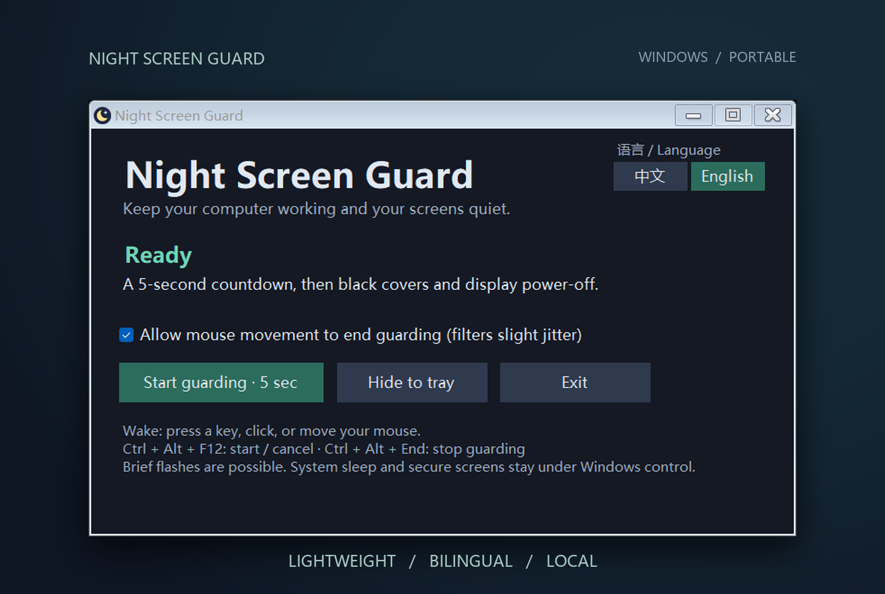

  
  

<h1 align="center">Night Screen Guard</h1>

<strong>Let AI keep working. Let yourself rest.</strong>

Developed by <a href="https://github.com/PB-in-GH">PB-in-GH</a> · Original author and developer

  

---

Want to leave your **AI agent working overnight**, but the screen's glow keeps you awake? Turned it off, only for a notification to light up the room again? Worried about burn-in from leaving your display on all night?

**Meet Night Screen Guard.** One click before bed keeps AI tasks, downloads, renders and other background work running while the app tries to prevent unwanted screen wake-ups. In the morning, move your mouse or press a key to pick up where you left off.

It does more than show a black overlay: it **requests display power-off**. Compatible monitors can enter standby with the screen fully dark, reducing nighttime light and the burn-in risk from prolonged screen use.

### Three steps to a quieter night

1. **Open** — Download, extract and run `NightScreenGuard.exe`.
2. **Rest** — Click **Start guarding**, release the keyboard and mouse, and wait five seconds.
3. **Resume** — Move your mouse or press a key to restore the display.

No keyboard or mouse input content is recorded, no online services are used, and all features run locally.

Results depend on your monitor; brief wake-ups may still occur.

---

Windows 10/11 x64 · .NET Framework 4.8 · <a href="LICENSE">Source available · Noncommercial</a> · <a href="https://github.com/PB-in-GH/NightScreenGuard/issues">Report an issue</a>

© 2026 PB-in-GH. This version uses PolyForm Noncommercial 1.0.0, grants no commercial-use license, and requires preservation of attribution and license notices when distributing. <a href="NOTICE">Earlier licensing</a>

