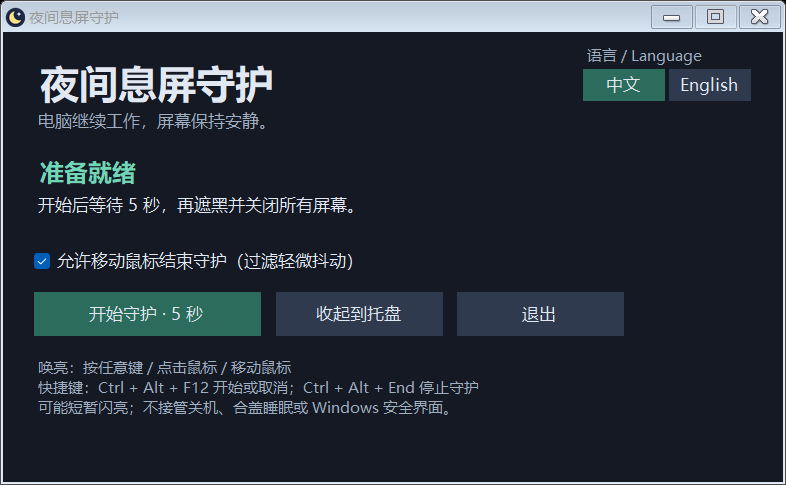

# 夜间息屏守护 · Night Screen Guard

[中文](README.md) | [English](README.en.md)

**[下载 Windows 版](https://github.com/PB-in-GH/NightScreenGuard/releases/latest) · [反馈问题](https://github.com/PB-in-GH/NightScreenGuard/issues)**

轻量、免安装的 Windows 息屏工具。夜间关掉屏幕，让下载、计算和其他后台任务照常运行。

它不只是显示黑色遮罩，而是向 Windows 请求关闭显示器，并尽量阻止通知等非本人操作造成的持续亮屏。操作键盘或鼠标，即可结束守护、恢复显示。

支持的显示器可直接进入待机，让屏幕不再发光，减少长时间亮屏带来的烧屏风险和夜间光线对睡眠的干扰。具体表现取决于显示器，偶尔仍可能短暂亮起。

## 使用

1. 下载并解压 Windows 版，打开 `NightScreenGuard.exe`。
2. 点击“开始守护”，松开键鼠，5 秒后息屏。
3. 按键、点击或移动鼠标，即可恢复显示；移动唤亮可在界面中关闭。

支持 **中文 / English** 切换。单击托盘月亮图标打开窗口，右键菜单可退出。系统月亮键保持原来的行为。

快捷键：`Ctrl + Alt + F12` 开始或取消守护；`Ctrl + Alt + End` 停止守护。

## 隐私

不记录键鼠输入内容，不进行任何联网服务，所有功能均在本地运行。

Windows 10/11 x64 · .NET Framework 4.8 · [MIT License](LICENSE)
