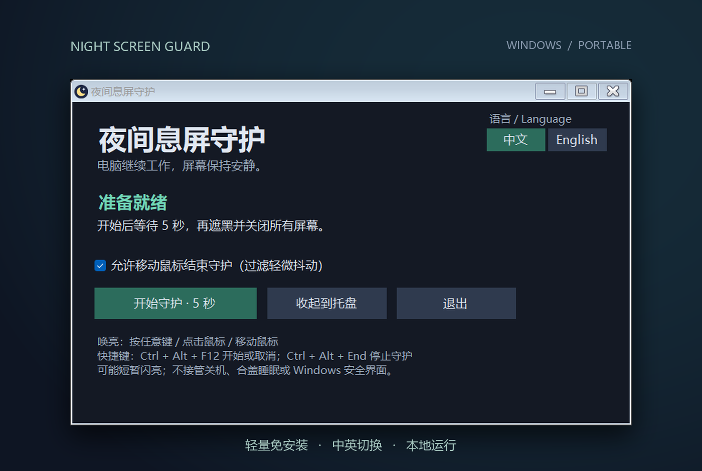

  
  

<h1 align="center">夜间息屏守护</h1>

<strong>让 AI 继续忙碌，让你安心入眠。</strong>

由 <a href="https://github.com/PB-in-GH">PB-in-GH</a> 开发

  

---

夜里想让电脑上的 **AI Agent 继续跑任务**，屏幕的亮光却让你睡不着？明明已经关了屏，一条通知又把房间照亮？也担心屏幕整夜亮着，时间久了会烧屏？

**来试试夜间息屏守护吧。** 睡前轻轻一点，AI、下载、渲染和其他后台任务照常运行，软件会尽量挡住非本人操作引起的亮屏。早上动动鼠标或按一下键盘，就能继续使用。

它不只是盖上一层黑色遮罩，而是**请求关闭显示器**。支持的显示器可以直接进入待机，让屏幕不再发光，减少夜间打扰和长时间亮屏带来的烧屏风险。

### 三步，安心入眠

1. **打开** — 下载并解压，运行 `NightScreenGuard.exe`。
2. **息屏** — 点击“开始守护”，松开键鼠，5 秒后息屏。
3. **唤亮** — 动动鼠标或按一下键盘，即可继续使用。

不记录键鼠输入内容，不进行任何联网服务，所有功能均在本地运行。

实际息屏效果因显示器而异，偶尔仍可能短暂亮起。

---

Windows 10/11 x64 · .NET Framework 4.8 · <a href="LICENSE">源码公开 · 禁止转售</a> · <a href="https://github.com/PB-in-GH/NightScreenGuard/issues">反馈问题</a>

© 2026 PB-in-GH。本版本采用 MIT + Commons Clause 1.0。个人及企业可免费使用；禁止售卖软件本身或收费提供主要价值来自其功能的产品与服务。分发须保留作者及完整许可声明。<a href="NOTICE">旧版许可说明</a>

